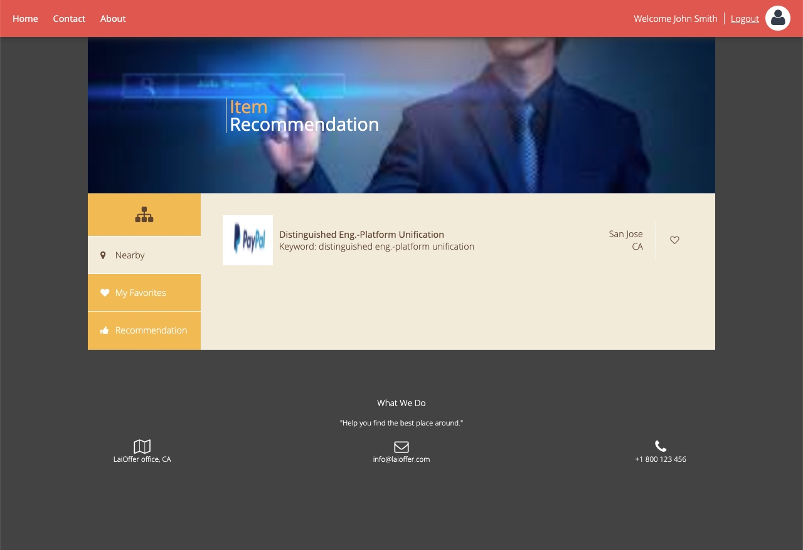

# Job Recommendation system
A web app can recommend the job for you

## Task
* Designed and implemented an interactive web application for users to search and apply for available job positions.
* Performed front-end web UI design and implementation using HTML/CSS/JavaScript. 
* Implemented RESTful APIs using Java servlets, retrieved job descriptions using Github API, and stored data in MySQL.
* Explored multiple recommendation algorithms and extracted keywords from job descriptions to implement a Content-based algorithm.
* Deployed the service to AWS EC2.

## Problem
* The github api Provide too little Posintion. which influence the display result
* The monkey learn may api limited the times may cause the keyword extract fail and then not display the keyword 

## To do:
 change the api which can display more job position
 
## Deploy at:
deployed in : http://18.220.187.166/jupiter/#

